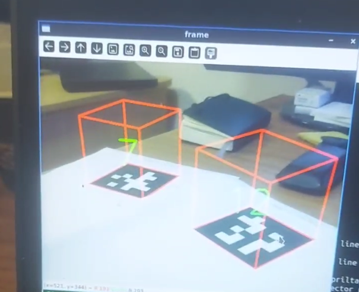

# OpenCV AprilTag minimal example

## Итак, первый день знакомства с OpenCV.

День приятных открытий.
**Открытие 1:** Легкая в использовани, простая и приятная библиотека apriltags. Вообще ничего не надо делать, только написать вызов метода. Правда под виндой пришлось использовать какой-то форк.

**Открытие 2.** cv2.solvePnP() Оказывается можно отдать в метод массив с 3D точками и массив с их проекциями на плоскость, и без программирования и танцев с бубнами, получить трансформационные вектора.

**Открытие 3.** cv2.projectPoints() Можно отдать коодинаты в виде (0.5, 0.5, 0.5) в специальный магический метод, вместе с трансформационными векторами, и на выходе получить проекцию этой точки на 2D плоскость. solvePnP()+projectPoints() = <3

## День второй

OpenCV продолжает удивлять удобствами. Круто, что можно скормить сразу массив точек в метод cv2.projectPoints(), потому что если там под капотом numpy, то это должно улучшить производительность.

Очень приятно подцепляется камера, сама режет все на кадры. Не очень понял как потом исправленный кадр, объединенный с нарисованными поверх линиями, встраивается опять в поток, но как-то встроился, вроде работает. Надо конечно вникать.

Два непонятных параметра initialize_camera_matrix() и distortion_coefficients. Непонятно что там внутри происходит, хорошо бы разобраться. Явно связано с параметрами камеры, но почему именно так реализовано - непонятно.

Хотел сделать, чтобы ID внутри тега тоже увеличивалось/уменьшалось в зависимости от размеров куба. Для этого надо считать среднюю длину всех ребер, и от этого значения менять размер шрифта. Какого-то более изящного способа не вижу.

Вобщем приложение работает, на всех тэга, которые видит камера - дорисовывает куб и ставит номер внутри.

